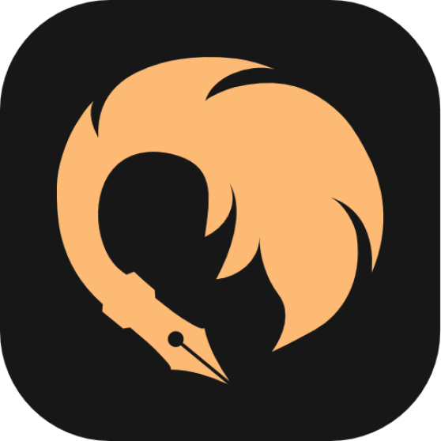

# Taleweave

## Table of Contents

[About the project](#about-the-project)

[Discord](#discord)

[Tech Stack](#tech-stack)

[Roadmap](#roadmap)

[Getting Started](#getting-started)

- [Prerequisites](#prerequisites)
- [Installation](#installation)

[Contributing](#contributing)

[License](#license)

## About the project

Taleweave is an open-source, and easy to use platform for writers and authors alike to share their stories and works of literature freely. On this platform you as an author can create an account, write your stories, and publish them for the world to see and appreciate. Taleweave is by writers, for writers.

## Discord

Taleweave has a discord server where you can get help, ask questions, and get involved in the community. Join the discord server today!

[](https://discord.gg/CXz9Aqb9My)

## Tech Stack

Originally built as a pet project, this platform is built on cutting-edge web technologies like sveltekit for the frontend, prisma + planetscale for the database, lucia for authentication and authorization, and tailwindcss for styling.

- **Frontend**: [SvelteKit](https://kit.svelte.dev/)
- **Database**: [Prisma](https://www.prisma.io/) + [PlanetScale](https://planetscale.com/)
- **Authentication**: [Lucia](https://lucia.js.org/)

## Roadmap

See the Github projects page for a list of features and enhancements that are planned for the future.

[Roadmap :link:](https://github.com/users/joshwcorbett/projects/1?query=is:open+sort:updated-desc)

## Getting Started

To get started developing for this project locally, follow the simple steps outlined below:

### Prerequisites

Make sure you have the following installed on your machine:

- [Node.js](https://nodejs.org/en/) (v18 or later is recommended)
- [pnpm](https://pnpm.io/)

### Installation

1. Clone the repo

   ```sh
   git clone https://github.com/joshwcorbett/taleweave.git taleweave
    ```

2. Install dependencies

    ```sh
   pnpm install
    ```

3. Create your own `.env` file and populate it with the following value:

   ```sh
   DATABASE_URL="mysql://<username>:<password>@<host>:<port>/<database>?connection_limit=1"
   ```

4. Run the project

   ```sh
   pnpm dev
   ```

## Contributing

Any contributions you make are **greatly appreciated**. Feel free to fork the project and submit a pull request.

## License

Distributed under the Apache 2.0 License. See [LICENSE](./LICENSE.txt) for more information.
